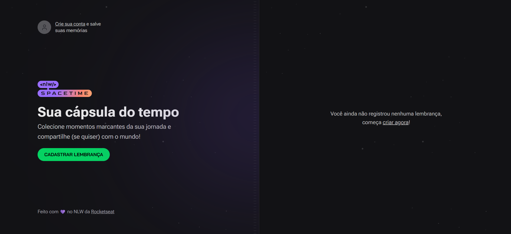

<h1 align="center">
  Spacetime
</h1>

  <a href="#-instalar">Instalar</a>&nbsp;&nbsp;&nbsp;|&nbsp;&nbsp;&nbsp;
  <a href="#-tecnologias">Tecnologias</a>&nbsp;&nbsp;&nbsp;|&nbsp;&nbsp;&nbsp;
  <a href="#-projeto">Projeto</a>&nbsp;&nbsp;&nbsp;|&nbsp;&nbsp;&nbsp;
  <a href="#-layout">Layout</a>&nbsp;&nbsp;&nbsp;|&nbsp;&nbsp;&nbsp;
  <a href="#-autor">Autor</a>

 

  

## 👨🏾‍💻 Instalar  

- Instale o [Visual Studio Code](https://code.visualstudio.com/)
- Baixe o [Zip do código](https://github.com/Ronald785/spacetime-nlw12/archive/refs/heads/main.zip)
- Descompacte o arquivo e abra no VS Code
- Abra o terminal do VS Code ( ctrl + " )
- Instale as dependências do server, web e mobile: npm install
- Para iniciar o projeto digite em cada pasta: npm run dev 
- Acessa a porta [localhost:3000](http://localhost:3000) do navegador 
- Voilà o projeto está rodando

## 🚀 Tecnologias

Esse projeto foi desenvolvido com as seguintes tecnologias:

- [React](https://pt-br.reactjs.org/)
- [React Native](https://reactnative.dev/)
- [Next](https://nextjs.org/)
- [Tailwindcss](https://tailwindcss.com/)
- [TypeScript](https://www.typescriptlang.org/)
- [Node](https://nodejs.org/en)

## 💻 Projeto

Aplicação de recordação de memórias, onde o usuário poderá adicionar à uma timeline textos, fotos e vídeos de acontecimentos marcantes da sua vida, organizados por mês e ano.

## 🔖 Layout

Você pode visualizar o layout do projeto no [Figma](https://www.figma.com/community/file/1240070456276424762/C%C3%A1psula-do-tempo-%E2%80%A2-Trilha-Ignite).

## ✍🏾 Autor

Contate-me

---
   
Desenvolvido no Next Level Week 12 Trilha Ignite da [Rocketseat](https://rocketseat.com.br/)🚀
